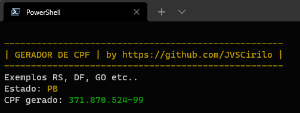

# Gerador de CPF
## Como usar?

A aplicação está disponível apenas para Windows

1. Baixe a última versão do executável [(Download aqui)](https://github.com/JVSCirilo/gerador-de-cpf/releases/tag/v0.0.1-2)

1. Inicie

1. Digite a sigla de um dos estados brasileiros em maiúsculo onde será gerado o CPF, ex.: "AM", "PB", "SP", etc.

